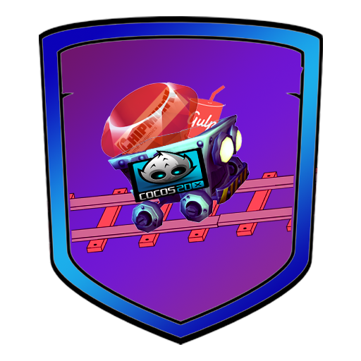

#cocos_on_rails

##rails websocket html5 multiplayer boilerplate. Rails is an authortative server running chipmunk physics in one thread. Regular updates about state are delivered on another.
### extreme WIP

[![video][2]][1]

  [1]: https://drive.google.com/file/d/0B30Vmzi9uv6keXFfTC11aHBtS2s/view?usp=sharing
  [2]: https://www.dropbox.com/s/wh8fr0w15l3ux25/Screenshot%202016-10-11%2017.02.13.png?raw=1 (hover text)

###installation
```
bundle install
cd client
npm install(this should trigger jspm install at the end)
gulp build
rails s
```

###Thanks
https://github.com/beoran/chipmunk
http://buildnewgames.com/real-time-multiplayer/
https://github.com/arjanfrans/realtime-multiplayer-in-html5
